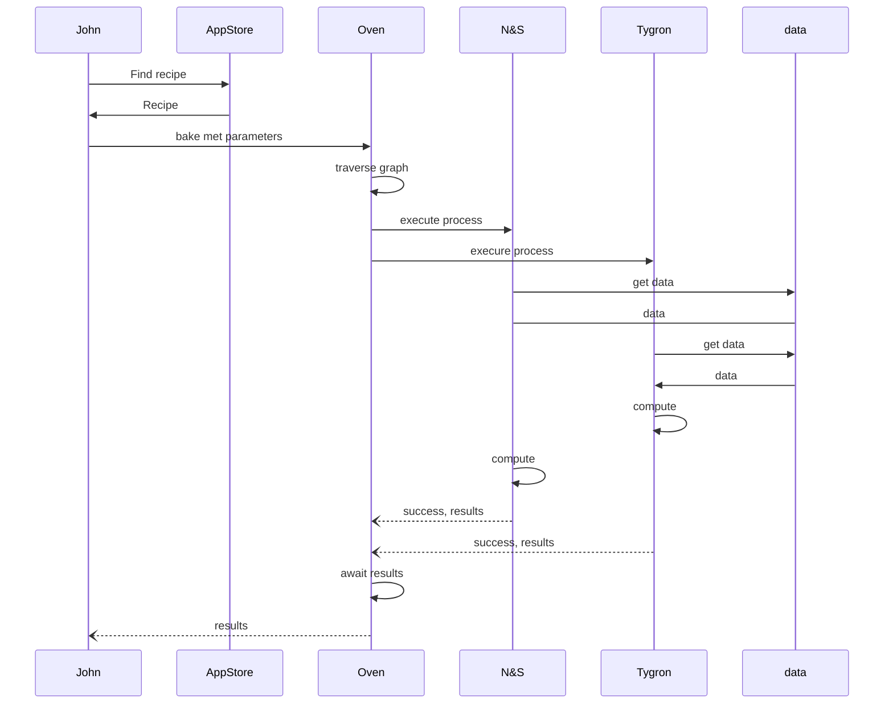

# nLDT-AppStore
nLDT App Store beschrijving

## Respec Document

Het respec document is te vinden op: [https://geonovum.github.io/nLDT-AppStore/](https://geonovum.github.io/nLDT-AppStore/)

### English

The English version of the NLDT Architecture can be found here: [https://geonovum.github.io/nLDT-AppStore/en/](https://geonovum.github.io/nLDT-AppStore/en/)

## Sequence diagram

